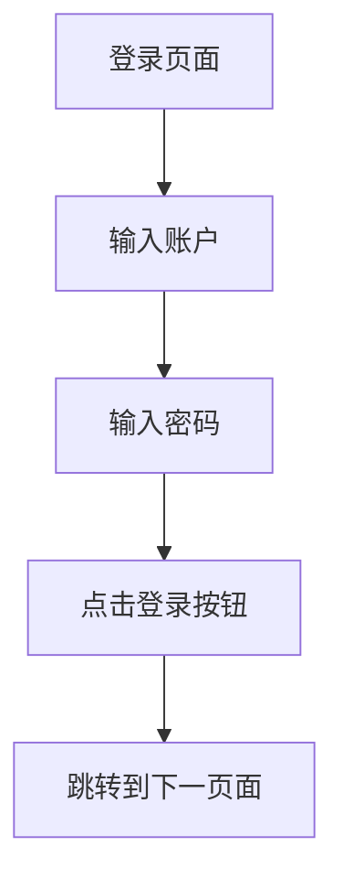

## 1. 产品概述
StartAGI登录页面是一个现代化的用户认证界面，采用分屏设计，左侧展示科幻风格的3D芯片插图，右侧提供简洁的登录表单。该页面旨在为用户提供直观、专业的登录体验，作为进入StartAGI系统的入口。

## 2. 核心功能

### 2.1 用户角色
本产品暂不需要用户角色区分，所有用户均可访问登录页面。

### 2.2 功能模块
我们的登录页面包含以下核心模块：
1. **登录页面**：分屏布局、欢迎标题、登录表单、版权信息。

### 2.3 页面详情
| 页面名称 | 模块名称 | 功能描述 |
|-----------|-------------|-------------|
| 登录页面 | 左侧插图区域 | 展示深色科幻3D芯片插图，包含黑色/炭色块体和橙色/金色光线 |
| 登录页面 | 欢迎标题 | 显示"欢迎来到 StartAGI"标题和副标题文本 |
| 登录页面 | 登录表单 | 包含账户输入框（带用户图标）、密码输入框（带锁图标）、登录按钮 |
| 登录页面 | 版权信息 | 显示版权所有文本和年份信息 |

## 3. 核心流程
用户访问登录页面流程：
1. 用户进入登录页面，看到分屏布局的界面
2. 在右侧表单的账户输入框中输入账户信息
3. 在密码输入框中输入密码
4. 点击"登录"按钮
5. 系统验证成功后跳转到下一页面

## 4. 用户界面设计

### 4.1 设计风格
- **主色调**：深蓝色渐变 (#3478F6–#3A7BFF)
- **背景色**：深色面板 (#1f2430到#232833)
- **文字颜色**：标题白色 (#FFFFFF)，正文浅灰色 (#AEB4BF)，占位符中灰色 (#8C94A3)
- **输入框背景**：深灰色 (#2A2F3A)
- **按钮样式**：圆角矩形，实心蓝色，白色文字
- **字体**：现代无衬线字体，标题32-36px，正文16-18px
- **图标风格**：线性图标，浅灰色

### 4.2 页面设计概述
| 页面名称 | 模块名称 | UI元素 |
|-----------|-------------|-------------|
| 登录页面 | 左侧插图 | 占据60-65%宽度，深色科幻3D芯片插图，黑色炭色块体配橙色金色光线 |
| 登录页面 | 右侧面板 | 占据35-40%宽度，深色背景，包含所有交互元素 |
| 登录页面 | 欢迎标题 | "欢迎来到"白色加粗大字，"StartAGI"蓝色加粗，副标题浅灰色小字 |
| 登录页面 | 登录区域标题 | "登录"中文白色半粗体，"LOG IN"英文浅灰色大写字母间距 |
| 登录页面 | 输入框组 | 账户输入框带用户图标，密码输入框带锁图标，深灰色背景，浅灰色边框 |
| 登录页面 | 登录按钮 | 蓝色渐变背景，白色文字，圆角矩形，全宽度，44-48px高度 |
| 登录页面 | 版权信息 | 极小字体(11-12px)，浅灰色，底部对齐 |

### 4.3 响应式设计
- **桌面优先**：默认设计为桌面端，左侧插图和右侧表单固定比例
- **移动端适配**：在小屏幕设备上调整为上下布局或隐藏插图
- **触摸优化**：按钮和输入框具有足够的点击区域，适合触摸操作

### 4.4 3D场景指导
左侧插图区域采用科幻风格的3D芯片设计：
- **环境氛围**：深色科技实验室环境，营造未来感
- **光照设置**：主要光源为橙色/金色，营造科技感和温暖感
- **构图元素**：前景为芯片细节，中景为电路板结构，背景为数据流动效果
- **性能考虑**：使用优化的3D模型和纹理，确保页面加载速度